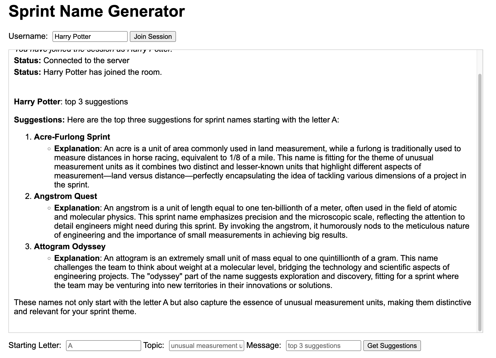

# SprintNameBot

SprintNameBot is a real-time collaborative tool that helps engineering teams generate creative sprint names based on themes like "unusual measurement units". It provides an interactive web interface where team members can join sessions, request name suggestions, and share results in real-time.



## Features

- **AI-Powered Suggestions**: Leverages OpenAI's GPT models to generate creative sprint names.
- **Real-Time Collaboration**: Multiple team members can join the same session and see suggestions in real-time.
- **Customizable Parameters**:
    - Specify the starting letter for sprint names.
    - Set custom themes beyond the default "unusual measurement units".
    - Tailor the prompt for different types of suggestions.
- **Markdown Support**: Rich text formatting in the chat interface.

## Technologies Used

- **Backend**: Flask with Flask-SocketIO.
- **Frontend**: HTML, CSS, and vanilla JavaScript with Socket.IO client.
- **AI Integration**: OpenAI API (gpt-4o-mini model).
- **Markdown Rendering**: Marked.js.

## Getting Started

### Prerequisites

- Python 3.x
- OpenAI API key

### Installation

1. Clone the repository.
2. Install the required packages:
     ```bash
     pip install flask
     pip install flask_socketio
     pip install flask_cors
     pip install openai
     npm install -g localtunnel
     ```
3. Set your OpenAI API key (uncomment and update the `OPENAI_API_KEY` in `SprintNameBot.py`).

### Running the Application

1. Start the server:
     ```bash
     python SprintNameBot.py
     ```
2. Open [http://127.0.0.1:12345](http://127.0.0.1:12345) in your web browser.
3. Enter a username and click "Join Session".
4. Configure your sprint name request and click "Get Suggestions".
5. (Optional if you need public access) Run `npx localtunnel -p 12345`
6. (Optional if you need public access) Copy the url into the html file and replace the `serverUrl`

## Usage Examples

### Join a live session shareable with team members:
1. Enter your name and click the "Join Session" button to join the live session

### Get sprint names starting with a specific letter:

1. Enter the desired letter in the "Starting Letter" field (e.g., "E").
2. Click "Get Suggestions".

### Change the theme for name generation:

1. Enter a new theme in the "Topic" field (e.g., "astronomical phenomena").
2. Click "Get Suggestions".

### Request specific types of suggestions:

1. Enter your request in the "Message" field (e.g., "top 3 alliterative names").
2. Click "Get Suggestions".

### Vote on Suggestions:

1. After receiving a list of suggestions, each team member can vote for their favorite.
2. Add an input and click "Add Option" to add sprint name candidate.
3. Click "Vote" button on each suggestions to add votes.
4. "Clear Options" will clear all options while "Clear Votes" will clear votes on all options.
